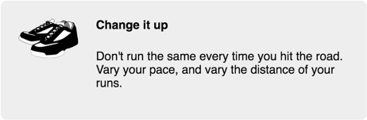
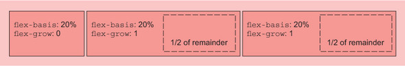
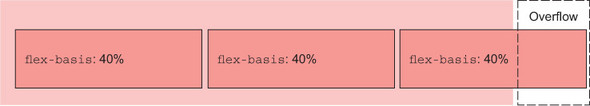
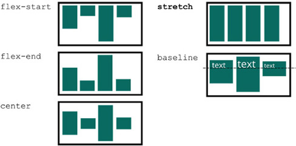
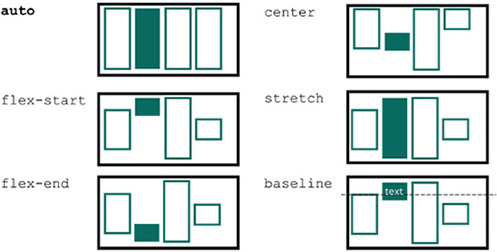
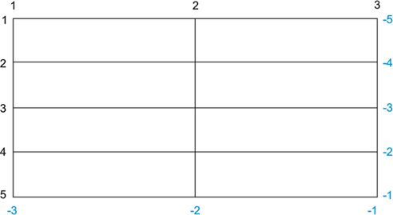

# Learning Notes of CSS in Depth

## Cascade, Specifity, and Inheritance

### The Cascade

When declarations conflict, the cascade considers three things to resolve the difference:

1. Stylesheet origin — Where the styles come from. Your styles are applied in conjunction with the browser’s default styles.
2. Selector specificity — Which selectors take precedence over which.
3. Source order — Order in which styles are declared in the stylesheet.

#### Stylesheet Origin

Author styles > user styles > user agent styles

#### Specifity

The exact rules of specificity are:

* If a selector has more IDs, it wins (that is, it’s more specific).
* If that results in a tie, the selector with the most classes wins.
* If that results in a tie, the selector with the most tag names wins.

#### Source Order

LoVe/HAte—link, visited, hover, active

#### Two Rules of Thumb

1. Don't use IDs in your selector.
2. Don't use !important.

If you’re creating a JavaScript module for distribution (such as an NPM package), I strongly urge you not to apply styles inline via JavaScript if it can be avoided. If you do, you’re forcing developers using your package to either accept your styles exactly or use !important for every property they want to change.  
Instead, include a stylesheet in your package. If your component needs to make style changes dynamically, it’s almost always preferable to use JavaScript to add and remove classes to the elements. Then users can use your stylesheet, and they have the option to edit it however they like without battling specificity.

### Special Values

`initial` - reset the property of an element to its default value.

### Shorthand Properties

#### Beaware shorthands silently overriding other styles

```css
h1 {
  font-weight: bold;
}

.title {
  font: 32px Helvetica, Arial, sans-serif;
}
```

`h1` will not have `bold` for its `font-weight` because the code is equivalent to:

```css
h1 {
  font-weight: bold;
}

.title {
  font-style: normal;
  font-variant: normal;
  font-weight: normal;
  font-stretch: normal;
  line-height: normal;
  font-size: 32px;
  font-family: Helvetica, Arial, sans-serif;
}
```

## Relative Units

### Ems and Rems

Ems, the most common relative length unit, are a measure used in typography, referring to a specified font size. In CSS, 1 em means the font size of the current element; its exact value varies depending on the element you’re applying it to.

```css
.box {
  padding: 1em;
  border-radius: 1em;
  background-color: lightgray;
}

.box-small {
  font-size: 12px;
}

.box-large {
  font-size: 18px;
}
```

font-size ems are derived from the inherited font size.

```css
body {
  font-size: 16px;
}

.slogan {
  font-size: 1.2em;
}
```

The root node is the ancestor of all other elements in the document. It has a special pseudo-class selector (`:root`) that you can use to target it. This is equivalent to using the type selector html with the specificity of a class rather than a tag. `Rem` is short for root em.

```css
:root {
  font-size: 1em;
}

ul {
  font-size: .8rem;
}
```

Use `rem` for font sizes, pixels for borders, and `em` for most other measures, especially paddings, margins, and border radius (use percentages for container widths when necessary).

The `>` is a direct descendant combinator.

### Making the panel resposive

By applying these font sizes at the root on your page, you’ve responsively redefined the meaning of em and rem throughout the entire page. This means that the panel is now responsive, even though you made no changes to it directly.

```css
:root {
  font-size: 0.75em;
}

@media (min-width: 800px) {
  :root {
    font-size: 0.875em;
  }
}

@media (min-width: 1200px) {
  :root {
    font-size: 1em;
  }
}

.panel {
  padding: 1em;
  border-radius: 0.5em;
  border: 1px solid #999;
}

.panel > h2 {
  margin-top: 0;
  font-size: 0.8rem;
  font-weight: bold;
  text-transform: uppercase;
}
```

### Viewport-relative Units

Viewport-relative units for defining lengths relative to the browser’s viewport.  
`viewport` — The framed area in the browser window where the web page is visible. This excludes the browser’s address bar, toolbars, and status bar, if present.

* `vh` — 1/100th of the viewport height
* `vw` — 1/100th of the viewport width
* `vmin` — 1/100th of the smaller dimension, height or width (IE9 supports vm instead of vmin)
* `vmax` — 1/100th of the larger dimension, height or width (not supported in IE)

E.g. a square element defined with both a height and a width of 90 vmin, which equals 90% of the smaller of the two dimensions—90% of the height on landscape screens, or 90% of the width on portrait.

```css
.square {
  width: 90vmin;
  height: 90vmin;
  background-color: #369;
}
```

#### Using `vw` for Font Size

Consider what would happen if you applied font-size: 2vw to an element. On a desktop monitor at 1,200 px, this evaluates to 24 px (2% of 1,200). On a tablet with a screen width of 768 px, it evaluates to about 15 px (2% of 768). And, the nice thing is, the element scales smoothly between the two sizes. This means there’re no sudden breakpoint changes; it transitions incrementally as the viewport size changes.  
Unfortunately, 24 px is a bit too large on a big screen. And worse, it scales all the way down to 7.5 px on an iPhone 6. What would be nice is this scaling effect, but with the extremes a little less severe. You can achieve this with CSS’s calc() function.

```css
:root {
  font-size: calc(0.5em + 1vw);
}
```

### Unitless Numbers and Line-height

A unitless `0` can only be used for length values and percentages, such as in *paddings, borders, and widths*. It can’t be used for angular values, such as *degrees* or time-based values like *seconds*.  
The `line-height` property is unusual in that it accepts both units and unitless values. You should typically use **unitless numbers** because they’re inherited differently.  
When you use a unitless number, that declared value is inherited, meaning its computed value is recalculated for each inheriting child element.

### Custom Properties (AKA CSS Variables)

The name must begin with two hyphens `(--)` to distinguish it from CSS properties, followed by whatever name you’d like to use. A function called `var()` allows the use of variables. The `var()` function accepts a second parameter, which specifies a fallback value. If the variable specified in the first parameter is not defined, then the second value is used instead. If a `var()` function evaluates to an invalid value, the property will be set to its initial value.

```css
:root {
  --main-font: Helvetica, Arial, sans-serif;
  --brand-color: #369;
}

p {
  font-family: var(--main-font);
  color: var(--secondary-color, blue);  
} 
```

#### Changing Custom Properties Dynamically

```html
<body>
  <div class="panel">                               1
    <h2>Single-origin</h2>
    <div class="body">
      We have built partnerships with small farms
      around the world to hand-select beans at the
      peak of season. We then careful roast in
      small batches to maximize their potential.
    </div>
  </div>

  <aside class="dark">                              2
    <div class="panel">                             2
      <h2>Single-origin</h2>
      <div class="body">
        We have built partnerships with small farms
        around the world to hand-select beans at the
        peak of season. We then careful roast in
        small batches to maximize their potential.
      </div>
    </div>
  </aside>
</body>
```

```css
:root {
  --main-bg: #fff;
  --main-color: #000;
}

.panel {
  font-size: 1rem;
  padding: 1em;
  border: 1px solid #999;
  border-radius: 0.5em;
  background-color: var(--main-bg);
  color: var(--main-color);
}

.panel > h2 {
  margin-top: 0;
  font-size: 0.8em;
  font-weight: bold;
  text-transform: uppercase;
}

.dark {
  margin-top: 2em;
  padding: 1em;
  background-color: #999;
  --main-bg: #333;
  --main-color: #fff;
}
```

Be aware that any declaration using var() will be ignored by old browsers that don’t understand it. Provide a fallback behavior for those browsers when possible:

```css
p {
  color: black;
  color: var(--main-color);
}
```

## Box Model

### Adjusting the Box Model

When you set the width or height of an element, you’re specifying the width or height of its content; any padding, border, and margins are then added to that width.


By default, `box-sizing` is set to the value of `content-box`. This means that any height or width you specify only sets the size of the content box. You can assign a value of `border-box` to the box sizing instead. That way, the height and width properties set the combined size of the content, padding, and border.


### Using Universal Border-box Sizing

Adding this snippet near the beginning of your stylesheet has become common practice.

```css
*,
::before,
::after {
  box-sizing: border-box;
}
```

If, however, you add third-party components with their own CSS to your page, you may see some broken layouts for those components, especially if their CSS wasn’t written with this fix in mind.  
You can make this easier with a slightly modified version of the fix and inheritance. Update this portion of your stylesheet to match the following listing.

```css
:root {
  box-sizing: border-box;
}

*,
::before,
::after {
  box-sizing: inherit;
}
```

### Difficulties with Element Height

#### Equal-height Columns

Implement equal-height columns with `display: table`.

By default, an element with a table display value won’t expand to a 100% width like a block element will, so you’ll have to declare the width explicitly. Margins 4 can’t be applied to table-cell elements. To define space between cells of a table, you can use the `border-spacing` property of the table element, but this has a peculiar side effect: that value is also applied to the outside edges of the table. You can fix this with the clever use of a negative margin, but that needs to go on a new container that wraps around the whole table.

```html
<body>
  <header>
    <h1>Franklin Running Club</h1>
  </header>
  <div class="wrapper">
    <div class="container">
      <main class="main">
        <h2>Come join us!</h2>
        <p>
          The Franklin Running club meets at 6:00pm every Thursday
          at the town square. Runs are three to five miles, at your
          own pace.
        </p>
      </main>
      <aside class="sidebar">
        <div class="widget"></div>
        <div class="widget"></div>
      </aside>
    </div>
  </div>
</body>
```

```css
.wrapper {
  margin-left: -1.5em;
  margin-right: -1.5em;
  border-spacing: 1.5em 0;
}

.container {
  display: table;
  width: 100%;
}

.main {
  display: table-cell;
  width: 70%;
  background-color: #fff;
  border-radius: .5em;
}

.sidebar {
  display: table-cell;
  width: 30%;
  padding: 1.5em;
  background-color: #fff;
  border-radius: .5em;
}
```

Implement equal-height columns with `display: flex`.

By applying `display: flex` to the container, it becomes a flex container. Its child elements will become the same height by default. Even though this would add up to more than a 100%, the flexbox sorts it out.

Never explicitly set the height of an element unless you have no other choice. Always seek an alternative approach first. Setting a height invariably leads to further complications.

Two properties that can be immensely helpful are `min-height` and `max-height`. Instead of explicitly defining a height, you can use these properties to specify a minimum or maximum value, allowing the element to size naturally within those bounds.

```html
<body>
  <header>
    <h1>Franklin Running Club</h1>
  </header>
  <div class="container">
    <main class="main">
      <h2>Come join us!</h2>
      <p>
        The Franklin Running club meets at 6:00pm every Thursday
        at the town square. Runs are three to five miles, at your
        own pace.
      </p>
    </main>
    <aside class="sidebar">
      <div class="widget"></div>
      <div class="widget"></div>
    </aside>
  </div>
</body>
```

```css
.container {
  display: flex;
}

.main {
  width: 70%;
  background-color: #fff;
  border-radius: 0.5em;
}

.sidebar {
  width: 30%;
  padding: 1.5em;
  margin-left: 1.5em;
  background-color: #fff;
  border-radius: .5em;
}
```

#### Vertically Centering Content

A `vertical-align` declaration only affects inline and table-cell elements.

Guide to Vertical Centering

* *Can you use a natural height container?* Apply an equal top and bottom padding to the container to center its contents.
* *Do you need a specific height container, or do you need to avoid using padding?* Use `display: table-cell` and `vertical-align: middle` on your container.
* *Can you use flexbox?* If you don’t need to support IE9, you can center your content with flexbox.
* *Is the inner content only one line of text?* Set a tall line height equal to the desired container height. This will force the container to grow to contain the line height. If the contents aren’t inline, you may have to set them to `inline-block`.
* *Do you know the height of both the container and the inner content?* Center the contents with absolute positioning. (I only recommend this when all approaches mentioned here fail.)
* *What if you don’t know the height of the inner element?* Use absolute positioning in conjunction with a transform. (Again, I only recommend this if you’ve ruled out all other options.)

<http://howtocenterincss.com/>

### Negative Margins


Using negative margins to overlap elements can render some elements unclickable if they’re moved beneath other elements.

### Collapse Margins

When top and/or bottom margins are adjoining, they overlap, combining to form a single margin. This is referred to as `collapsing`.

The main reason for collapsed margins has to do with the spacing of blocks of text. Paragraphs (`<p>`), by default, have a 1 em top margin and a 1 em bottom margin. This is applied by the user agent stylesheet. But when you stack two paragraphs, one after the other, their margins don’t add up to a gap of 2 em. Instead they collapse, overlapping to produce only 1 em of space between the two paragraphs.

Elements don’t have to be adjacent siblings for their margins to collapse. Even if you wrap the paragraph inside an extra `div`, the visual result will be the same. In the absence of any other CSS interfering, all the adjacent top and bottom margins will collapse.

Margin collapsing only occurs with top and bottom margins. Left and right margins don’t collapse.

Here are ways to prevent margins from collapsing:

* Applying `overflow: auto` (or any value other than `visible`) to the container prevents margins inside the container from collapsing with those outside the container. This is often the least intrusive solution.
* Adding a `border` or `padding` between two margins stops them from collapsing.
* Margins won’t collapse to the outside of a container that is `floated`, that is an `inline block`, or that has an `absolute` or `fixed` position.
* When using a `flexbox`, margins won’t collapse between elements that are part of the flex layout. This is also the case with `grid layout`.
* Elements with a `table-cell` display don’t have a margin, so they won’t collapse. This also applies to `table-row` and most other table display types. Exceptions are `table`, `table-inline`, and `table-caption`.

### Spacing Elements within a Container

Use the adjacent sibling combinator (+) to target only element that immediately follow other element as siblings under the same parent element.

```css
.button-link + .button-link {
  margin-top: 1.5em;
}
```

#### Lobotomized Owl Selector

```css
body * + * {
  margin-top: 1.5em;
}
```

## Making Sense of Floats

### The Purpose of Floats

A `float` pulls an element (often an image) to one side of its container, allowing the document flow to wrap around it. This layout is common in newspapers and magazines, so floats were added to CSS to achieve this effect. If you float multiple elements in the same direction, they’ll stack alongside one another.

Floats are still the only way to move an image to the side of the page and allow text to wrap around it.

Double container pattern - The outer container has a 100% width, and the inner container has `max-width` and `margin: auto`.

### Container Collapsing and The Clearfix

Unlike elements in the normal document flow, floated elements do not add height to their parent elements. This may seem odd, but it goes back to the original purpose of floats. Floats are intended to allow text to wrap around them. When you float an image inside a paragraph, the paragraph does not grow to contain the image. This means, if the image is taller than the text of the paragraph, the next paragraph will start immediately below the text of the first, and the text in both paragraphs will wrap around the float.


One way to correct container collapsing is to use `clear`. Because this empty div itself is not floated, the container will extend to encompass it, thereby containing the floats above it as well.

```html
<main class="main">
  ...
  <div style="clear: both"></div>
</main>
```

Instead of adding an extra div to your markup, you’ll use a `pseudo-element`. By using the `::after` pseudo-element selector, you can effectively insert an element into the DOM at the end of the container, without adding it to the markup.

`pseudo-element` — Special selectors that target certain parts of the document. These begin with a double-colon (`::`) syntax, though most browsers also support a single-colon syntax for backward compatibility. The most common pseudo-elements are `::before` and `::after`, which are used to insert content at the beginning or end of an element.

A common approach to the problem of containing floats, called a `clearfix`.

```css
.clearfix::before,
.clearfix::after {
  display: table;
  content: " ";
}

.clearfix::after {
  clear: both;
}
```

(`display: table` prevents margins from collapsing through the pseudo elements.)

It’s important to know that the `clearfix` is applied to the element that contains the floats; a common mistake is to apply it to the wrong element, such as the floats or the container after the one that contains them.

### Unexpected "Float Catching"

The browser places floats as high as possible.


Fixes: for two columns

```css
.media:nth-child(odd) {
  clear: left;
}
```

For three columns

```css
.media:nth-child(3n + 1) {
  clear: left;
}
```

This technique for clearing each row only works when you know how many elements are on each row. If the width is defined using something other than a percentage, the number of items can vary, depending on the viewport width. In this case, your best bet is to use a different layout technique such as the flexbox or inline-block elements.

### Media Object and Block Formatting Contexts



You can establish a new block formatting context in several ways. Applying any of the following property values to an element triggers one:

* `float: left or float: right` — anything but `none`
* `overflow: hidden, auto, or scroll` — anything but `visible`
* `display: inline-block, table-cell, table-caption, flex, inline-flex, grid, or inline-grid` — these are called block containers.
* `position: absolute` or `position: fixed`

Using `overflow: auto` for the BFC is generally the simplest approach. You can use instead the other properties mentioned earlier, but some have considerations to take into account: A float or an inline-block will grow to 100% width, so you’d need to restrict the width of the element to prevent it from line wrapping below the float. On the contrary, a table-cell element will only grow enough to contain its contents, so you may need to set a large width to force it to fill the remaining space.

### Grid System

```css
[class*="column-"] {
  float: left;
}

.column-1 { width: 8.3333%; }
.column-2 { width: 16.6667%; }
.column-3 { width: 25%; }
.column-4 { width: 33.3333%; }
.column-5 { width: 41.6667%; }
.column-6 { width: 50%; }
.column-7 { width: 58.3333%; }
.column-8 { width: 66.6667%; }
.column-9 { width: 75%; }
.column-10 { width: 83.3333%; }
.column-11 { width: 91.6667% }
.column-12 { width: 100%; }
```

The first selector here may be new to you. It’s an `attribute selector`, targeting elements based on their class attribute. This allows you to do something a little more complex than what you can do with a normal class selector. The `*=` comparator specifies any values that include the substring specified: any elements with `column-` anywhere within the class attribute. This targets `<div class="column-2">` as well as `<div class="column-6">`. In short, it targets any of your column classes. Now all columns, regardless of their size, will float left.

## Flexbox

### Flexbox Priciples

Flexbox begins with the familiar `display` property. Applying `display: flex` to an element turns it into a `flex container`, and its direct children turn into `flex items`. By default, flex items align side by side, left to right, all in one row. The flex container fills the available width like a block element, but the flex items may not necessarily fill the width of their flex container. The flex items are all the same height, determined naturally by their contents.

You can also use `display: inline-flex`. This creates a flex container that behaves more like an `inline-block` element rather than a block. It flows inline with other inline elements, but it won’t automatically grow to 100% width. Flex items within it generally behave the same as with display: flex. Practically speaking, you won’t need to use this very often.


The items are placed along a line called the `main axis`, which goes from the `main-start` (left) to the `main-end` (right). Perpendicular to the main axis is the `cross axis`. This goes from the `cross-start` (top) to the `cross-end` (bottom). The direction of these axes can be changed.

If you happen to use flexbox in an older browser, such as IE10 or Safari 8, you’ll find that it doesn’t work. That’s because older browsers require `vendor prefixes` on flexbox attributes. This is how browsers have supported several new CSS features before the specification was stable. Instead of implementing `display: flex`, for example, older versions of Safari implemented `display: -webkit-flex`. You’ll need to add this declaration for flexbox to work in Safari 8, followed by the normal one.

```css
display: -ms-flexbox;
display: -webkit-flex;
display: flex;
```

Automate this process with a tool called Autoprefixer. <https://github.com/postcss/autoprefixer>

Flexbox allows you to use `margin: auto` to fill available space between the flex items.

### Flex Item Sizes

The `flex` property controls the size of the flex items along the main axis (that is, the width).

The `flex` property, which is applied to the flex items, gives you a number of options. E.g., using `flex` to apply widths of two-thirds and one-third.

```css
.column-main {
  flex: 2;
}

.column-sidebar {
  flex: 1;
}
```

The `flex` property is shorthand for three different sizing properties: `flex-grow`, `flex-shrink`, and `flex-basis`. In this listing, you’ve only supplied `flex-grow`, leaving the other two properties to their default values (1 and 0% respectively). So `flex: 2` is equivalent to `flex: 2 1 0%`. These shorthand declarations are generally preferred, but you can also declare the three individually.

#### Using the flex-basis Property

The `flex basis` defines a sort of starting point for the size of an element — an initial “main size”. The `flex-basis` property can be set to any value that would apply to `width`, including values in `px`, `ems`, or `percentages`. Its initial value is `auto`, which means the browser will look to see if the element has a `width` declared. If so, the browser uses that size; if not, it determines the element’s size naturally by the contents. This means that `width` will be ignored for elements that have any flex basis other than `auto`.


Once this initial main size is established for each flex item, they may need to grow or shrink in order to fit (or fill) the flex container along the main axis. That’s where `flex-grow` and `flex-shrink` come in.

#### Using flex-grow

Once `flex-basis` is computed for each flex item, they (plus any margins between them) will add up to some width. This width may not necessarily fill the width of the flex container, leaving a remainder. The remaining space (or remainder) will be consumed by the flex items based on their `flex-grow` values, which is always specified as a non-negative integer. If an item has a `flex-grow` of `0`, it won’t grow past its flex basis.



#### Using flex-shrink

The `flex-shrink` property follows similar principles as `flex-grow`. After determining the initial main size of the flex items, they could exceed the size available in the flex container. Without `flex-shrink`, this would result in an overflow.



The `flex-shrink` value for each item indicates whether it should shrink to prevent overflow. If an item has a value of `flex-shrink: 0`, it will not shrink. Items with a value greater than `0` will shrink until there is no overflow. An item with a higher value will shrink more than an item with a lower value, proportional to the `flex-shrink` values.

### Flex Direction

Another important option in flexbox is the ability to shift the direction of the axes. The `flex-direction` property, applied to the flex container, controls this. Its initial value (row) causes the items to flow `left-to-right`. Specifying `flex-direction: column` causes the flex items to stack vertically (`top to bottom`) instead. Flexbox also supports `row-reverse` to flow items right to left, and `column-reverse` to flow items bottom to top.


When working with a vertical flexbox (column or column-reverse), the same general concepts for rows apply, but there’s one difference to keep in mind—in CSS, working with height is fundamentally different than working with widths. A flex container will be 100% the available width, but the height is determined naturally by its contents. This behavior does not change when you rotate the main axis.

The flex container’s height is determined by its flex items. They fill it perfectly. In a vertical flexbox, `flex-grow` and `flex-shrink` applied to the items will have no effect unless something else forces the height of the flex container to a specific size.

### Alignment, Spacing and Other Details

#### Flex container properties

| Property | Comment | Values |
| -------- | ------- | ------ |
| `flex-wrap` | |  |
| `flex-flow` | Shorthand for `<flex-direction>` `<flex-wrap>` | |
| `justify-content` | Controls how items are positioned along the main axis. |  |
| `align-items` | Controls how items are positioned along the cross axis. |  |
| `align-content` | If flex-wrap is enabled, this controls the spacing of the flex rows along the cross axis. If items don’t wrap, this property is ignored. |  |

#### Flex Item Properties

| Property | Comment | Values |
| -------- | ------- | ------ |
| `align-self` | Controls how the item is aligned on the cross axis. This will override the container’s align-items value for specific item(s). Ignored if the item has an auto margin set on the cross axis. |  |
| `order` | An integer that moves a flex item to a specific position among its siblings, disregarding source order. |  |

#### Understanding Flex Container Properties

When `flex-wrap` is enabled, the items don’t shrink according to their flex-shrink values. Instead, any items that would overflow the flex container wrap onto a new line.  
If the flex direction is `column` or `column-reverse`, then `flex-wrap` will allow the flex items to overflow into a new column. However, this only happens if something constrains the height of the container; otherwise, it grows to contain its flex items.

`justiy-content` property applies spacing after `margins` and `flex-grow` values are calculated. This means if any items have a non-zero flex-grow value, or any items have an auto margin on the main axis, then justify-content has no effect.

The initial value for `align-items` is `stretch`, which causes all items to fill the container’s height in a row layout, or width in a column layout. This provides columns of equal height.  
The value `baseline` is useful if you want the baseline of a header in one flex item with a large font to line up with the baseline of smaller text in the other flex items.

### Flexbugs

<https://github.com/philipwalton/flexbugs>

## Grid Layout

Grid layout applies to two levels of the DOM hierarchy. An element with `display: grid` becomes a grid container. Its child elements then become grid items.

```css
.grid {
  display: grid;
  grid-template-columns: 1fr 1fr 1fr;
  grid-template-rows: 1fr 1fr;
  grid-gap: 0.5em;     
}

.grid > * {
  background-color: darkgray;
  color: white;
  padding: 2em;
  border-radius: 0.5em;
}
```

`grid-template-columns` and `grid-template-rows` define the size of each of the columns and rows in the grid. `fr` represents each column’s (or row’s) *fraction unit*. This unit behaves essentially the same as the `flex-grow` factor in flexbox. The declaration `grid-template-columns: 1fr 1fr 1fr` declares three columns with an equal size.  
You don’t necessarily have to use fraction units for each column or row. You can also use other measures such as `px`, `em`, or `percent`. Or, you could mix and match. For instance, `grid-template-columns: 300px 1fr` would define a fixed-size column of 300 px followed by a second column that will grow to fill the rest of the available space.

`grid-gap` property defines the amount of space to add to the gutter between each grid cell. You can optionally provide two values to specify vertical and horizontal spacing individually (for example, `grid-gap: 0.5em 1em`).

### Anatomy of a Grid

* *Grid line* — These make up the structure of the grid. A grid line can be vertical or horizontal and lie on either side of a row or column. The `grid-gap`, if defined, lies atop the grid lines.
* *Grid track* — A grid track is the space between two adjacent grid lines. A grid has horizontal tracks (rows) and vertical tracks (columns).
* *Grid cell* — A single space on the grid, where a horizontal grid track and a vertical grid track overlap.
* *Grid area* — A rectangular area on the grid made up by one or more grid cells. The area is between two vertical grid lines and two horizontal grid lines.


`repeat()` function provides a shorthand for declaring multiple grid tracks. `grid-template-rows: repeat(4, auto);` defines four horizontal grid tracks of height auto. It’s equivalent to grid-template-rows: auto auto auto auto. The track size of auto will grow as necessary to the size of its content.

You can also define a repeating pattern with the `repeat()` notation. For instance, `repeat(3, 2fr 1fr)` defines six grid tracks by repeating the pattern three times, resulting in 2fr 1fr 2fr 1fr 2fr 1fr.


#### Numbering Grid Lines



Use the grid numbers to indicate where to place each grid item using the `grid-column` and `grid-row` properties. If you want a grid item to span from grid line 1 to grid line 3, you’ll apply `grid-column: 1 / 3` to the element. Or, you can apply `grid-row: 3 / 5` to a grid item to make it span from the horizontal grid line 3 to grid line 5. These two properties together specify the grid area you want for an element.

These properties are in fact shorthand properties: `grid-column` is short for `grid-column-start` and `grid-column-end`; `grid-row` is short for `grid-row-start` and `grid-row-end`. The forward slash is only needed in the shorthand version to separate the two values.

You can also specify `grid-`row` and `grid-column` using a special keyword, `span`. This tells the browser that the item will span one grid track. I didn’t specify an explicit row with which to start or end, so the grid item will be placed automatically using the *grid item placement algorithm*. The placement algorithm will position items to fill the first available space on the grid where they fit.

```css
header,
nav {
  grid-column: 1 / 3;
  grid-row: span 1;
}
```

#### Working together with Flexbox

The two layout methods have two important distinctions:

* Flexbox is basically one-dimensional, whereas grid is two-dimensional.
* Flexbox works from the content out, whereas grid works from the layout in.


When your design calls for an alignment of items in two dimensions, use grid. When you’re only concerned with a one-directional flow, use flexbox. In practice, this will often (but not always) mean grid makes the most sense for a high-level layout of the page, and flexbox makes more sense for certain elements within each grid area.

### Alternate Syntaxes

There are two other alternate syntaxes for laying out grid items: named grid lines and named grid areas.

#### Naming Grid Lines

```css
.grid {
  grid-template-columns: [start] 2fr [center] 1fr [end];
}

.area {
  grid-column: start / center;
}
```

Provide multiple names for the same grid line.

```css
.grid {
  grid-template-columns: [left-start] 2fr
    [left-end right-start] 1fr
    [right-end];
}
```

#### Naming Gird Areas

```css
.container {
  display: grid;
  grid-template-areas: "title title"
    "nav   nav"
    "main  aside1"
    "main  aside2";
  grid-template-columns: 2fr 1fr;
  grid-template-rows: repeat(4, auto);

header {
  grid-area: title;
}

nav {
  grid-area: nav;
}

.main {
  grid-area: main;
}

.sidebar-top {
  grid-area: aside1;
}

.sidebar-bottom {
  grid-area: aside2;
}
```

Each named grid area must form a rectangle. You cannot create more complex shapes like an *L* or a *U*.

You can also leave a cell empty by using a `period` as its name.

```css
.grid {
  grid-template-areas: "top  top    right"
    "left .      right"
    "left bottom bottom";
}
```

### Explicit and Implicit Grid

When you use the `grid-template-*` properties to define grid tracks, you’re creating an *explicit grid*. But grid items can still be placed outside of these explicit tracks; in which case, implicit tracks will be automatically generated, expanding the grid so it contains these elements.  
By default, implicit grid tracks will have a size of `auto`, meaning they’ll grow to the size necessary to contain the grid item contents. The properties `grid-auto-columns` and `grid-auto-rows` can be applied to the *grid container* to specify a different size for all implicit grid tracks (for example, grid-auto-columns: 1fr).  
Implicit grid tracks don’t change the meaning of negative numbers when referencing grid lines. Negative grid-line numbering still begins at the bottom/right of the explicit grid.

```css
.portfolio {
  display: grid;
  grid-template-columns: repeat(auto-fill, minmax(200px, 1fr));
  grid-auto-rows: 1fr;
  grid-gap: 1em;
}
```

`minmax()` function specifies two values—a minimum size and a maximum size. The browser will ensure the grid track falls between these values. (If the maximum size is smaller than the minimum size, then the maximum is ignored.)

The `auto-fill` keyword is a special value you can provide for the `repeat()` function. With this set, the browser will place as many tracks onto the grid as it can fit, without violating the restrictions set by the specified size (the minmax() value).

Together, `auto-fill` and `minmax(200px, 1fr)` mean your grid will place as many grid columns as the available space can hold, without allowing any of them to be smaller than 200 px. And because no track can be larger than 1 fr (our maximum value), all the grid tracks will be the same size.

Note that `auto-fill` can also result in some empty grid tracks, if there are not enough grid items to fill them all. If you don’t want empty grid tracks, you can use the keyword `auto-fit` instead of `auto-fill`.

#### Adding Variety

`grid-auto-flow` can be used to manipulate the behavior of the placement algorithm. Its initial value, `row`, places grid items column by column, row by row, according to the order of the items in the markup. When an item doesn’t fit in one row (that is, it spans too many grid tracks), the algorithm moves to the next row, looking for space large enough to accommodate the item. Given the value `column`, it instead places items in the columns first, moving to the next row only after a column is full.

You can also add the keyword `dense` (for example, `grid-auto-flow: column dense`). This causes the algorithm to attempt to fill gaps in the grid, even if it means changing the display order of some grid items.

```css
.portfolio {
  display: grid;
  grid-template-columns: repeat(auto-fill, minmax(200px, 1fr));
  grid-auto-rows: 1fr;
  grid-gap: 1em;
  grid-auto-flow: dense;
}

.portfolio .featured {
  grid-row: span 2;
  grid-column: span 2;
}
```

One limitation of grid is the specific DOM structure required — namely, all grid items must be direct children of the grid container. Thus, it’s not possible to align deeply nested elements on the grid.

You can give the grid item `display: grid` to create an inner grid within the outer one. But the grid items of the inner grid will not necessarily align to the grid tracks of the outer grid. Nor will the size of items in one grid affect the size of the grid tracks in the other grid.

#### Adjust grid items to fill the grid track

CSS provides a special property for controlling image stretching, `object-fit`. By default, an `` has an `object-fit` value of `fill`, meaning the entire image will be resized to fill the `` element. You can also set other values to change this.

`object-fit` property accepts the values `cover` and `contain`. These values tell the browser to resize the image within the rendered box, without distorting its aspect ratio.

* To expand the image to fill the box (resulting in part of the image being cut off), use cover.
* To resize the image so that it fits entirely in the box (resulting in empty space within the box), use contain.


There’s an important distinction to make here: there is the box (determined by the `` element’s height and width), and there is the rendered image. By default, these are the same size. The `object-fit` property lets you manipulate the size of the rendered image within that box, but the size of the box itself remains unchanged.

Because you’ll use the `flex-grow` property to stretch the images, you should also apply `object-fit: cover` to prevent the images from being distorted. This will crop off a small bit of the edge of the images, which is a compromise you’ll have to make.

### Feature Queries

CSS has recently added something called a *feature query* that can help with this. It looks like this:

```css
@supports (display: grid) {
  ...
}
```

IE doesn’t support the `@supports` rule. That browser ignores any rules within the feature query block, regardless of the actual feature support. This is usually okay, as you’ll want the older browser to render the fallback layout.

Feature queries may be constructed in a few other ways as well:

* `@supports not(<declaration>)` — Only apply rules in the feature query block if the queried declaration isn’t supported.
* `@supports (<declaration>) or (<declaration>)` — Apply rules if either queried declaration is supported.
* `@supports (<declaration>) and (<declaration>)` — Apply rules only if both queried declarations are supported.

### Alignment

CSS provides three justify properties: `justify-content`, `justify-items`, `justify-self`. These properties control *horizontal* placement. And there are three alignment properties: `align-content`, `align-items`, `align-self`. These control *vertical* placement.


<https://gridbyexample.com/>

## Positioning and Stacking Contexts

The initial value of the `position` property is `static`. When you change this value to anything else, the element is said to be *positioned*. An element with static positioning is thus *not positioned*. Positioning is different: it removes elements from the document flow entirely. This allows you to place the element somewhere else on the screen. It can place elements in front of or behind one another, thus overlapping one another.

### Fixed Positioning

Applying `position: fixed` to an element lets you position the element arbitrarily within the viewport. This is done with four companion properties: `top`, `right`, `bottom`, and `left`. The values you assign to these properties specify how far the fixed element should be from each edge of the browser viewport.

When positioning an element, you’re not required to specify values for all four sides. You can specify only the sides you need and then use `width` and/or `height` to help determine its size. You can also allow the element to be sized naturally.

### Absolute Positioning

Absolute positioning works the same way, except it has *a different containing block*. Instead of its position being based on the viewport, its position is based on the closest **positioned** ancestor element.  
If none of the element’s ancestors are positioned, then the absolutely positioned element will be positioned based on something called the *initial containing block*. This is an area with dimensions equal to the viewport size, anchored at the top of the page.

### Relative Positioning

The `top`, `right`, `bottom`, and `left` properties, if applied, will shift the element from its original position, but it won’t change the position of any elements around it. 


Unlike `fixed` and `absolute` positioning, you cannot use `top`, `right`, `bottom`, and `left` to change the size of a relatively positioned element. Those values will only shift the position of the element `up` or `down`, `left` or `right`. You can use `top` or `bottom`, but not both together (`bottom` will be ignored); likewise, you can use `left` or `right`, but not both (`right` will be ignored).

#### Creating a CSS Triangle

<https://css-tricks.com/examples/ShapesOfCSS/>

### Stacking Contexts and Z-index

#### Understanding the rendering process and stacking order

As the browser parses HTML into the DOM, it also creates another tree structure called the *render tree*. This represents the visual appearance and position of each element. It’s also responsible for determining the order in which the browser will paint the elements. This order is important because elements painted later appear in front of elements painted earlier, should they happen to overlap.

First, `z-index` only works on *positioned* elements. You cannot manipulate the stacking order of *static* elements. Second, applying a `z-index` to a positioned element establishes something called a *stacking context*.

A `stacking context` consists of an element or a group of elements that are painted together by the browser. One element is the root of the stacking context, so when you add a `z-index` to a positioned element that element becomes the root of a new stacking context. All of its descendant elements are then part of that stacking context.

No element outside the stacking context can be stacked between any two elements that are inside it.

All the elements within a stacking context are stacked in this order, from back to front:

1. The root element of the stacking context
2. Positioned elements with a negative z-index (along with their children)
3. Non-positioned elements
4. Positioned elements with a z-index of auto (and their children)
5. Positioned elements with a positive z-index (and their children)

#### Use variables to keep track of z-indexes

```css
:root {
  --z-loading-indicator: 100;
  --z-nav-menu:          200;
  --z-dropdown-menu:     300;
  --z-modal-backdrop:    400;
  --z-modal-body:        410;
}
```

Use increments of 10 or 100, so you can insert new values in between should the need arise.

### Sticky Positioning

`sticky positioning`: The element scrolls normally with the page until it reaches a specified point on the screen, at which point it will “lock” in place as the user continues to scroll. The common use-case for this is sidebar navigation.

This feature is available in Chrome and Edge browsers. Safari supports it with the vendor prefix (`position: -webkit-sticky`). Typically, you’ll use fixed or absolute positioning as a fallback behavior for other browsers.

```css
.affix {
  position: sticky;
  top: 1em;
}
```

## Responsive Design

The three key principles to responsive design:

1. *A mobile first approach to design.* This means you build the mobile version before you construct the desktop layout.
2. *The @media at-rule.* With this rule, you can tailor your styles for viewports of different sizes. This syntax (often called media queries) lets you write styles that only apply under certain conditions.
3. *The use of fluid layouts.* This approach allows containers to scale to different sizes based on the width of the viewport.

### Mobile First

Mobile design means you’ll want the most important content to appear first in the HTML. Conveniently, this coincides with accessibility concerns: A screen reader gets right to the "good stuff".

`breakpoint` — A particular point at which the page styles change to provide the best possible layout for the screen size.

#### Creating a mobile menu

Screen readers use certain HTML5 elements such as `<form>`, `<main>`, `<nav>`, and `<aside>` as landmarks. This helps users with poor vision to quickly navigate the page. It’s important that you place the button to reveal your menu within the `<nav>` so it’s quickly discoverable when the user navigates there. Otherwise, the user would jump to the `<nav>` only to find it empty (the screen reader ignores the dropdown menu when `display: none` is applied).

When designing for mobile touchscreen devices, be sure to make all the key action items large enough to easily tap with a finger. Don’t make your users zoom in in order to tap precisely on a tiny button or link.

#### Adding the viewport meta tag

The viewport *meta tag* is an HTML tag that tells mobile devices you’ve intentionally designed for small screens. Without it, a mobile browser assumes your page is not responsive, and it will attempt to emulate a desktop browser.

```html
<head>
  ...
  <meta name="viewport" content="width=device-width, initial-scale=1">
  ...
</head>
```

The meta tag’s content attribute indicates two things. First, it tells the browser to use the device width as the assumed width when interpreting the CSS, instead of pretending to be a full size desktop browser. Second, it uses `initial-scale` to set the zoom level at 100% when the page loads.

### Media Queries

You should use ems for media query breakpoints. It’s the only unit that performs consistently in all major browsers should the user zoom the page or change the default font size. Pixel- and rem-based breakpoints are less reliable in Safari. Ems also have the benefit of scaling up or down with the user’s default font size, which is generally preferable.

#### Understanding types of media query

If you want a media query that targets one of multiple criteria, use a comma:

```css
@media (max-width: 20em), (min-width: 35em) { ... }
```

You can also use a number of other types of media features. Here’s some examples:

* `(min-height: 20em)` — Targets viewports 20 em and taller
* `(max-height: 20em)` — Targets viewports 20 em and shorter
* `(orientation: landscape)` — Targets viewports that are wider than they are tall
* `(orientation: portrait)` — Targets viewports that are taller than they are wide
* `(min-resolution: 2dppx)` — Targets devices with a screen resolution of 2 dots per pixel or higher; targets retina displays
* `(max-resolution: 2dppx)` — Targets devices with a screen resolution of up to 2 dots per pixel

Resolution-based media queries can be a little tricky, as browser support for this is newer. In short, the best way to target a high resolution (retina) display is to combine the two:

```css
@media (-webkit-min-device-pixel-ratio: 2),
  (min-resolution: 192dpi) { ... }
```

You can also place a media query in the `<link>` tag. Adding `<link rel="stylesheet" media="(min-width: 45em)" href="large-screen.css" />` to your page will apply the contents of the `large-screen.css` file to the page only if the min-width media query is true.

In most cases, it’ll be helpful to apply basic print styles inside of a `@media print {...}` media query.

Use `display: none` to hide non-essential parts of the page, such as navigational menus and footers. Globally change font colors to black and remove all background images and colors behind blocks of text. In many cases, a universal selector does the job for this.

```css
@media print {
  * {
    color: black !important;
    background: none !important;
  }
}
```

### Adding breakpoints to the page

Practically speaking, a mobile-first approach means the type of media query you’ll use the most should be `min-width`.

```css
.title {
  ...
}

@media (min-width: 35em) {
  .title {
    ...
  }
}

@media (min-width: 50em) {
  .title {
    ...
  }
}
```

On occasion, your mobile-only styles might be complex. It can be tedious overriding these rules at a larger breakpoint. In this case, it might make sense to contain these styles in a `max-width` media query so they only apply at the smaller breakpoint. Too many `max-width` media queries, however, could be a sign you haven’t followed the mobile first approach. They should be an **exception** and not the rule.

Always be sure each media query comes after the styles it overrides, so the styles within the media query take precedence.

Web designer Brad Frost has compiled a list of responsive patterns that you can browse at <https://bradfrost.github.io/this-is-responsive/patterns.html>.

Sometimes, you won’t even need the media queries, as natural line wrapping will take care of that for you. Flexbox layouts using `flex-wrap: wrap` and a reasonable `flex-basis` is an excellent way to do this. Similarly, a grid layout with `auto-fit` or `auto-fill` grid columns will determine how many items will fit in a row before wrapping to a new one. You could also use `inline-block` elements, though in that case, they won’t grow to fill the width of the container.

It’s easy to get sucked into thinking about specific devices. An iPhone 7 is this many pixels wide; a certain tablet is that many. Try not to worry about that. You’ll find hundreds of devices with hundreds of different screen resolutions; you’ll never test them all. Choose the breakpoints that make sense for your design, and it’ll play out well, regardless of the device a user has.

### Fluid Layout

`Fluid layout` refers to the use of containers that grow and shrink according to the width of the viewport.

A web page is responsive by default. Before you apply any CSS, block-level elements are no wider than the viewport and inline elements line wrap to avoid horizontal overflow. As you add styles, it’s your job to maintain the responsive nature of the page.

#### Dealing with tables

Tables are particularly problematic for fluid layout on mobile devices. If a table has more than a handful of columns, it can easily overflow the screen width.

One approach you can take is to force the table to display as normal block elements.

 

This layout is made up of `<table>`, `<tr>`, and `<td>` elements, but the declaration `display: block` has been applied, overriding their normal table, table-row, and table-cell display values. You can use a `max-width` media query to limit these changes to small viewports.

```css
table {
  width: 100%;
}

@media (max-width: 30em) {
  table, thead, tbody, tr, th, td {
    display: block;
  }

  thead tr {
    position: absolute;
    top: -9999px;
    left: -9999px;
  }

  tr {
    margin-bottom: 1em;
  }
}
```

Use some absolute positioning to remove the header row from view. Avoid `display: none` for accessibility: the headings to remain present to a screen reader.

### Responsive Images

The first thing you should do is always make sure your images are well compressed. Use the Save for web option in your image editor, which will greatly reduce the image’s file size, or use another image compression tool such as <https://tinypng.com/>.

#### Using multiple images for different viewport sizes

The best practice is to create a few copies of an image, each at a different resolution.

#### Using srcset to serve the correct image

For inlined images, a different approach is necessary: the `srcset` attribute. This attribute is a newer addition to HTML. It allows you to specify multiple image URLs for one `` tag, specifying the resolution of each.

```html

```

As part of a fluid layout, you should always ensure images don’t overflow their container’s width. Do yourself a favor and always add this rule to your stylesheet to prevent that from happening: `img { max-width: 100%; }`.

## Modular CSS

*Modular CSS* means breaking the page up into its component parts. These parts should be reusable in multiple contexts, and they shouldn’t directly depend upon one another. The end goal is that changes to one part of your CSS will not produce unexpected effects in another.

Instead of a stylesheet where any selector can do anything anywhere on the page, modular styles allow you to impose order. Each part of your stylesheet — which we’ll call a *module* — will be responsible for its own styles, and no module should interfere with the styles of another. This is the software principle of encapsulation applied to CSS.

### Base Styles: Laying the Ground

```css
:root {
  box-sizing: border-box;
}

*,
*::before,
*::after {
  box-sizing: inherit;
}

body {
  font-family: Helvetica, Arial, sans-serif;
}
```

Other base styles typically include link colors, heading styles, and margins. By default, the `<body>` has a small margin, which you may want to “zero” out. Depending on the project, you’ll potentially also want to apply styles for form fields, tables, and lists.

I recommend a library called `normalize.css`. This is a small stylesheet that helps even out discrepancies among the user agent stylesheets of various browsers. You can download it from <https://necolas.github.io/normalize.css/>. Add this before your stylesheet as part of your base styles.

Your base styles should be fairly generic. Only add styles here that you want applied to most or all of the page. There should be no **class names** or **IDs** in your selectors, so you only target elements by their tag type and the occasional pseudo-class. The idea is that these styles provide the global look you want, but are easy to override later when you need to.

```html
<div class="message">
  Save successful
</div>
```

```css
.message {
  padding: 0.8em 1.2em;
  border-radius: 0.2em;
  border: 1px solid #265559;
  color: #265559;
  background-color: #e0f0f2;
}
```

It’s important that the selector for this module consists only of the single class name. Nothing else in the selector restricts these styles to a certain place on the page. In contrast, using a selector like `#sidebar .message` would mean this module could only be used inside a #sidebar element. Without this restriction, the module is reusable in any context.

#### Variations of a module

You create a modifier by defining a new class name that begins with the module’s name. For instance, an error modifier for the Message module might be `message--error`. By including the module name, you clearly indicate that this class belongs with the Message module.

A popular convention is to use two hyphens to indicate a modifier: `message--error`, for example.

```css
.message {
  padding: 0.8em 1.2em;
  border-radius: 0.2em;
  border: 1px solid #265559;
  color: #265559;
  background-color: #e0f0f2;
}

.message--success {
  color: #2f5926;
  border-color: #2f5926;
  background-color:  #cfe8c9;
}

.message--warning {
  color: #594826;
  border-color: #594826;
  background-color:  #e8dec9;
}

.message--error {
  color: #59262f;
  border-color: #59262f;
  background-color:  #e8c9cf;
}
```

Always keep all the code for a module together in the same place. Then your stylesheet will consist of a series of modules, one after another.

This double-hyphen notation (`.message-error`) has been popularized by a methodology called This double-hyphen notation has been popularized by a methodology called *BEM*.

Never use descendant selectors to alter a module based on its location in the page. Following this one rule is the best thing you can do to prevent your stylesheet from ever descending into the madness of unmaintainable code.

#### Modules with multiple elements

These begin with the module name, followed by a double-underscore, then the name of the sub-element. (This is another convention from BEM methodology.) As with double-hyphen modifiers, the class name tells you at a glance what role the element plays and what module it belongs to.

```css
.media {
  padding: 1.5em;
  background-color: #eee;
  border-radius: 0.5em;
}
.media::after {
  content: "";
  display: block;
  clear: both;
}

.media__image {
  float: left;
  margin-right: 1.5em;
}

.media__body {
  overflow: auto;
  margin-top: 0;
}

.media__body > h4 {
  margin-top: 0;
}
```

```html
<div class="media">
  
  <div class="media__body">
    <h4>Strength</h4>
    <p>
      Strength training is an important part of
      injury prevention. Focus on your core&mdash;
      especially your abs and glutes.
    </p>
  </div>
</div>
```


You can also create variations of the module. Now, it’s trivial to make a version where the image floats right instead of left.

```css
.media--right > .media__image {
  float: right;
}
```


### Modules Composed Into Larger Structures

Your modules should each be responsible for one thing. Our Message module is responsible for making a message noticeable. Our Media module is responsible for positioning an image beside some text. You should be able to concisely summarize its purpose. Some modules will be for layout, others will be for stylistic purposes. When a module tries to do more than one thing, you should consider breaking it into smaller modules.

When you need to use the word *and* to describe a module’s responsibility, consider whether you’re potentially describing two (or more) responsibilities. This will keep each module small, focused, and easier to understand.

#### Naming modules

You need to give the module a name that’s meaningful no matter what context you might want to use it. You should also avoid names that simply describe the visual appearance. Instead, you need to ask yourself what this module represents conceptually.

### Utility Classes

Sometimes you’ll need a class to do one simple, very specific thing to an element. This could mean centering text, floating it left, or adding a clearfix, for example. These classes are called *utility classes*.

```css
.text-center {
  text-align: center !important;
}

.float-left {
  float: left;
}

.clearfix::before,
.clearfix::after {
    content: " ";
    display: table;
}
.clearfix::after {
    clear: both;
}

.hidden {
  display: none !important;
}
```

Utility classes are the only place you should use the important annotation. In fact, it might even be preferred.

Utility classes are meant to be quick helpers. You don’t need a full module when you need to do one simple thing on the page. When this is the case, use a utility class. Don’t get carried away, though. On most sites, you probably won’t need more than a dozen or so of these classes.

### CSS Methodologies

- OOCSS—Object-oriented CSS, created by Nicole Sullivan: <https://github.com/stubbornella/oocss/wiki>
- SMACSS—Scalable and Modular Architecture for CSS, created by Jonathan Snook: <https://smacss.com/>
- BEM—Block, Element, Modifier, developed at Yandex: <https://en.bem.info/methodology/>
- ITCSS—Inverted Triangle CSS, created by Harry Roberts: <https://www.creativebloq.com/web-design/manage-large-css-projects-itcss-101517528>

## Pattern Libraries